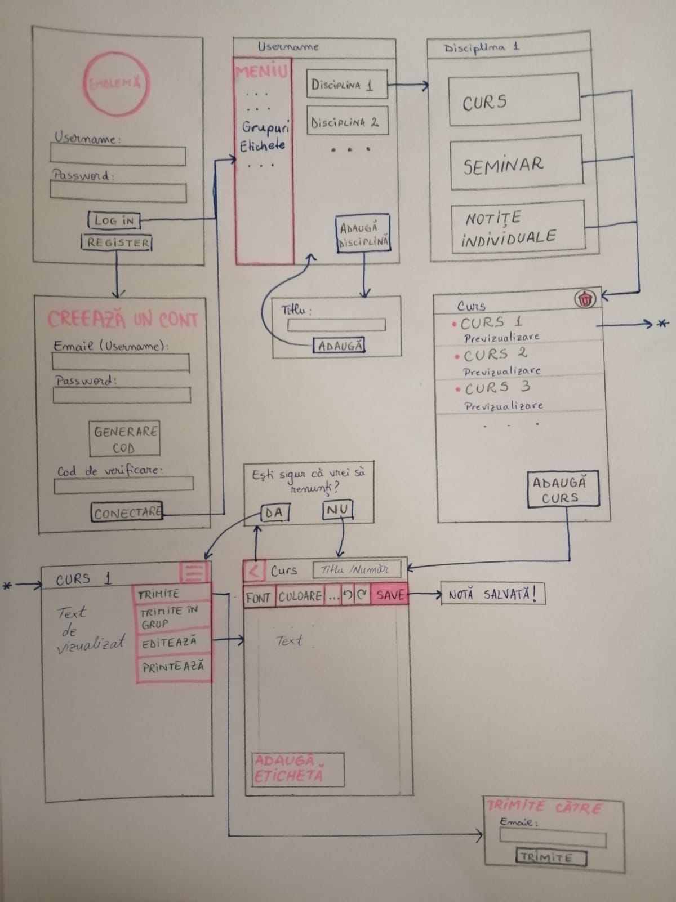

# StudentNotes_App
Echipa Spider, grupa 1074

## Membri:
* Anghel Cristina - *front-end*
* Balogh Hunor-Benjámin - *project management, testing*
* Barbărasă Ramona-Maria - *front-end*
* Bădițoiu Andreea-Denisa - *back-end*
* Băica Maria-Nicol - *back-end*

## DOCUMENTAȚIE APLICAȚIE

  Aplicația noastră se bazează atât pe editarea și creerea notițelor unui student, cât și pe organizarea acestora, astfel încât notițele să fie ușor de găsit și gestionat.  
  Deschiderea aplicației va cere logarea folosind contul de student (adresa de mail specifică), stocarea datelor realizându-se într-o bază de date.  
  Pagina principală va conține lista disciplinelor pentru care studentul își ia notițe, un meniu cu opțiuni (vizualizare grupuri, creare grup nou, etichete, etc) și un buton pentru crearea unui nou folder, pentru o nouă disciplină. Pentru o materie selectată sau nou creată, se va deschide un ecran cu trei categorii (foldere) și anume „Curs”, „Seminar” și „Studiu individual”. În fiecare subcategorie există o listă a notițelor deja create până în acel moment, cu posibilitatea vizualizării și editării acestora, dar și un buton de adăugare a unei notițe noi.  
  În ecranul de editare, pe lângă butonul de salvare, va fi posibilă și adăugarea de atașamente la nota curentă, de exemplu o imagine. Editarea presupune și adăugarea unui titlu, dată, etichete (pentru cuvinte cheie). După salvarea notei, studentul o poate partaja cu alți colegi, fie individual fie într-un grup. De asemenea, se poate șterge o notiță sau folderul unei discipline.
  
## App workflow  

## COMPONENTS
1. Pagina LOG IN -> Pagina INREGISTRARE
2. Lista materii
3. Lista curs/seminar/notite
4. Pagina PREVIZUALIZARE/EDITARE curs/seminar/notite
5. Share curs/seminar/notite

## API CALLS
* GET/CURS/:id
* GET/CURS
* GET/SEMINAR/:id
* GET/SEMINAR
* GET/NOTITE/:id
* GET/NOTITE
* POST/CURS
* POST/SEMINAR
* POST/NOTITE/
* PUT/CURS/:id
* PUT/CURS
* PUT/SEMINAR/:id
* PUT/SEMINAR
* PUT/NOTITE/:id
* PUT/NOTITE
* DELETE/CURS/:id
* DELETE/CURS
* DELETE/SEMINAR/:id
* DELETE/SEMINAR
* DELETE/NOTITE/:id
* DELETE/NOTITE

## USER ACTIONS
1. Logare/Inregistrare
2. Adaugare materie
3. Adaugare curs/seminar/notite aferent materiei
4. Previzualizare/Editare curs/seminar/notite
5. Trimitere curs/seminar catre o persoana/un grup 

